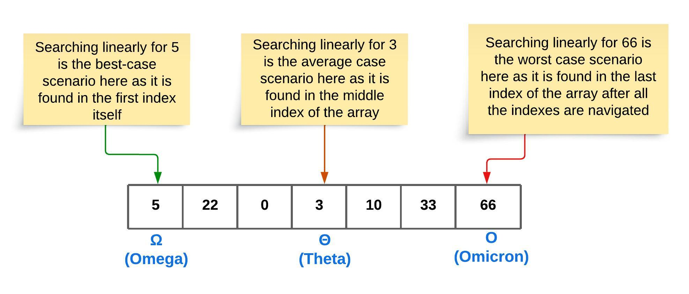
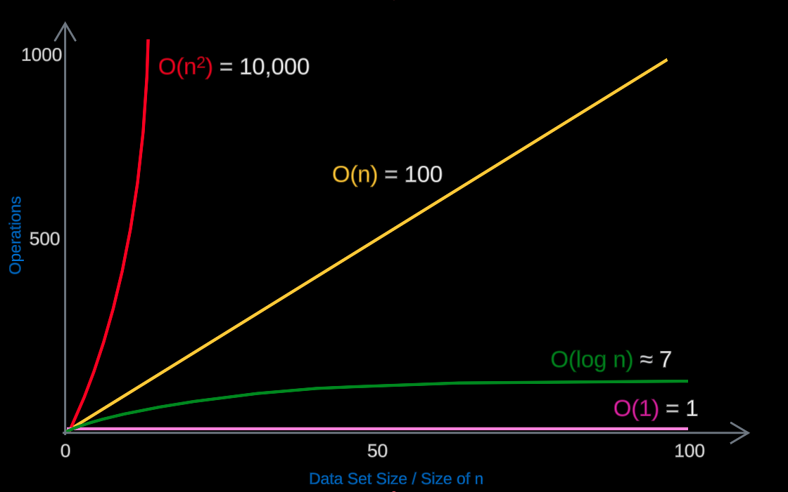
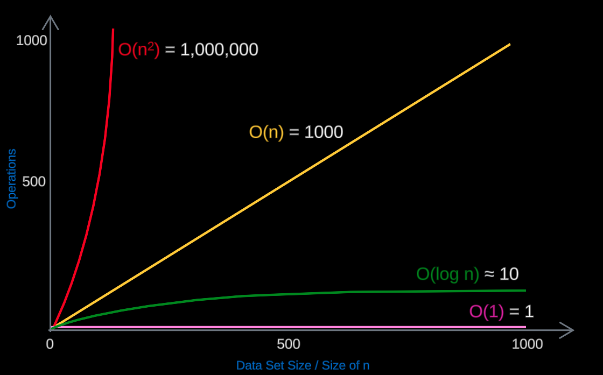
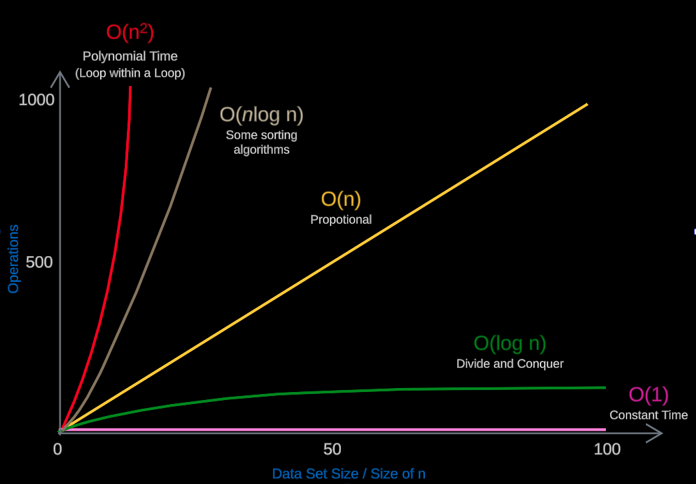

# Big O Notation

[1. Introduction](#1-introduction)

- [1.1 Introduction to Big O](#11-introduction-to-big-o)

- [1.2 Big O Worst Case](#12-big-o-worst-case)

- [1.3 Big O : O(n)](#13-big-o--on)

- [1.4 Big O : O(n<sup>2</sup>)](#14-big-o--onsup2sup)

- [1.5 Big O : O(1)](#15-big-o--o1)

- [1.6 Big O : O(log n)](#16-big-o--olog-n)

- [1.7 Big O : O(*n*log n)](#17-big-o--onlog-n)

- [1.8 Simplification rules for Big O](#18-simplification-rules-for-big-o)

[2. Big O - Different Terms of Input](#2-big-o---different-terms-of-input)

[3. Big O - Wrap-up and analysis](#3-big-o---wrap-up-and-analysis)

- [3.1 Example 1 :  When `n` is `100`](#31-example-1--when-n-is-100)

- [3.2 Example 2 :  When `n` is `1000`](#32-example-2--when-n-is-1000)

- [3.3 Summary Chart](#33-summary-chart)

## 1. Introduction

## 1.1 Introduction to Big O

- Big O notation is basically a way to measure the efficiency of an algorithm. It can also be called
  as a tool which describes the time complexity of an algorithm.


- It helps developers to compare two sets of code mathematically, one against the other about how
  efficient they run.


- It is important to measure or at least have an idea about the `Time Complexity` and
  the `Space Complexity` of code.


- Time complexity is interestingly not measured in time. It is
  actually `measured in the number of operations that it takes to complete some functionality`.


- Space complexity talks about the memory consumption of some code in order to complete some task/
  functionality.


- In certain requirements, time complexity can be the top priority over space complexity. In some
  cases it could be the other way around.

## 1.2 Big O Worst Case

### Omega (Ω) – Best Case

- **What it means:** `Omega (Ω) describes the best-case scenario for an algorithm.`


- **In simple terms:** `It tells you the fastest an algorithm can run in the best circumstances.`

### Theta (Θ) - Average Case

- **In simple terms:** `It tells you what to generally expect in terms of time complexity.`

### Big O (O) - Worst Case (O refers to Omicron and well known as Big O)

- **What it means:** `Big O (O) describes the worst-case scenario for an algorithm.`


- **In simple terms:** `It tells you the slowest an algorithm can run in the worst circumstances.`

<div align="center" style="margin-top:25px;margin-bottom:25px;">
  
</div>

- Technically Big O is always the worst case.

## 1.3 Big O : O(n)

> O(n): Linear Time

> Directly proportional to the data set size.

> Example: Looping through an array.

```java
public class BigOofNDemo {

  /**
   * Example 1: Looping through an array:
   * -----------------------------------------------------------------------------------------------
   * Loops through the given int[] array and prints each item. Here we have a single for loop which
   * traverse through the array. Therefore, in this case we have n number of operations where n is
   * the length of the array. So the time complexity will be O(n).
   *
   * @param array The array which is traversed through
   */
  public static void traverseThroughArray(int[] array) {
    for (int i = 0; i < array.length; i++) {
      System.out.println(array[i]);
    }
  }

  /**
   * Example 2: Printing a desired number of items:
   * -----------------------------------------------------------------------------------------------
   * Prints the items up to the provided n value. Here we have a single for loop which runs n number
   * of times. Therefore, in this case we have n number of operations and the time complexity will
   * be O(n).
   *
   * @param n The number up to which the items are printed out. In other words, the value of n is
   *          used to determine the number of items to be printed.
   */
  public static void printItems(int n) {
    for (int i = 0; i < n; i++) {
      System.out.println(i);
    }
  }

  /**
   * Java main method.
   *
   * @param args String array arguments
   */
  public static void main(String[] args) {
    traverseThroughArray(new int[]{1, 2, 3, 4, 5});
    printItems(3);
  }
}
```

- Program Output:

```
1
2
3
4
5
0
1
2
```

## 1.4 Big O : O(n<sup>2</sup>)

> O(n<sup>2</sup>): Polynomial Time

> Nested loops for each power of n.

> Example: Bubble sort (O(n<sup>2</sup>)).

```java
public class BigOofNSquare {

  /**
   * Prints the items up to the provided n value. Here we have nested for loops executed and the
   * time complexity will be O(n x n) = O(n^2) times.
   *
   * @param n The number up to which the items are printed out. In other words, the value of n is
   *          used to determine the number of items to be printed.
   */
  public static void printItems(int n) {
    for (int i = 0; i < n; i++) {
      for (int j = 0; j < n; j++) {
        System.out.println(i + " -- " + j);
      }
    }
  }

  /**
   * Java main method.
   *
   * @param args String array arguments.
   */
  public static void main(String[] args) {
    printItems(3);
  }
}
```

- Program Output:

```
0 -- 0
0 -- 1
0 -- 2
1 -- 0
1 -- 1
1 -- 2
2 -- 0
2 -- 1
2 -- 2
```

## 1.5 Big O : O(1)

> O(1): Constant Time

> Doesn't depend on the size of the data set.

> Example: Accessing an array element by its index.

```java
public class BigOof1Demo {

  /**
   * Returns the value of the specified index within the give int[] array. If the index is out of
   * bounds an exception will be thrown.
   *
   * Here, regardless of the size of the array (size of the data set), only one operation will be
   * performed as the given index is directly accessed and then the value is returned immediately.
   *
   * Therefore, this particular code is executed in constant time which can be represented as O(1).
   * This is the most efficient time complexity an algorithm/ piece of code can have.
   *
   * @param array Array to be searched
   * @param index Specified index to search for it's value
   * @return int
   */
  public static int getValueAt(int[] array, int index) {
    if (index >= 0 && index < array.length) {
      return array[index];
    }

    throw new RuntimeException("Out of range index value provided");
  }

  /**
   * Java main method.
   *
   * @param args String array arguments.
   */
  public static void main(String[] args) {
    int[] numbers = {23, 43, 56, 32, 23, 4546, 1232, 76, 234, 1, 0, 23, 66, 23, 43};
    System.out.println(getValueAt(numbers, 0));
    System.out.println(getValueAt(numbers, 3));
    System.out.println(getValueAt(numbers, 14));

    System.out.println(getValueAt(numbers, 22)); // Exception occurring scenario
  }
}
```

- Program Output:

```
23
32
43
Exception in thread "main" java.lang.RuntimeException: Out of range index value provided
	at com.myorg.dsa.s02_bigONotation.t01_bigOBasiConcepts.p03_BigOof1.BigOof1Demo.getValueAt(BigOof1Demo.java:27)
	at com.myorg.dsa.s02_bigONotation.t01_bigOBasiConcepts.p03_BigOof1.BigOof1Demo.main(BigOof1Demo.java:41)
```

## 1.6 Big O : O(log n)

> O(log n): Logarithmic Time

> Splits the data in each step (divide and conquer).

> Example: Binary search.

```java
public class BigOofLogNDemo {

  /**
   * Performs binary search on the provided sorted array and returns the index where the specified
   * value is available. if the value is not available at any of the indexes, then -1 is returned.
   *
   * Binary search uses the divide and concur strategy on the provided sorted array. Therefore,
   * the time complexity will be O(log n)
   *
   * @param sortedArray Provided sorted array to search
   * @param value       The value which is searched to find out it's index
   * @return int
   */
  public static int binarySearch(int[] sortedArray, int value) {
    int low = 0;
    int high = sortedArray.length - 1;
    int mid;

    while (low <= high) {
      mid = (low + high) / 2;

      // If the value is found in the middle, return its index immediately
      if (sortedArray[mid] == value) {
        return mid;
      }

      // If the value is less than the middle item value, then ignore the left half
      if (sortedArray[mid] < value) {
        low = mid + 1;
      }

      // If the value is greater than the middle item value, then ignore the right half
      if (sortedArray[mid] > value) {
        high = mid - 1;
      }
    }

    // Returns -1 in case if the value is not present in any of the indexes
    return -1;
  }

  /**
   * Java main method.
   *
   * @param args String array arguments.
   */
  public static void main(String[] args) {
    int[] sortedArray = {1, 2, 3, 4, 5, 6, 7, 8};
    System.out.println(binarySearch(sortedArray, 1));
    System.out.println(binarySearch(sortedArray, 4));
    System.out.println(binarySearch(sortedArray, 8));

    System.out.println(binarySearch(sortedArray, 10));
    System.out.println(binarySearch(sortedArray, -1));
    System.out.println(binarySearch(sortedArray, 23));
  }
```

- Program Output:

```
0
3
7
-1
-1
-1
````

- Consider the scenario where we search for the value `1`. How many steps were taken inorder to find
  out the index of the value `1` ?. Take look at the following breakdown.

> Initial stage of the sorted array [1, 2, 3, 4, 5, 6, 7, 8]

<h3>Step 1 &rarr;  [1, 2, 3, 4]  ~~[5, 6, 7, 8]~~</h3>

<h3>Step 2 &rarr;  [1, 2,] ~~[3, 4]~~</h3>

<h3>Step 3 &rarr;  [1] ~~[2]~~</h3>

- Above it is clear that the program has executed `3` steps in order to find the index of the
  value `1`. And remember we had `8` items in the array.


- The above point clearly state that the data set size is `8` and the number of operations performed
  is `3`.


- In terms of that the equation can be represented as **2<sup>3</sup> = 8** (two to the third power
  is eight). So when it is converted into a logarithm it looks like **log<sub>2</sub> 8 = 3** (log
  sub two of eight equals three).

  <h2>**2<sup>3</sup> = 8** &rarr; **log<sub>2</sub> 8 = 3**</h2>


- The idea behind **log<sub>2</sub> 8 = 3**

  <h2>**log<sub>2</sub> 8 = 3**</h2>

> If we took the number `8` and repeatedly divided it by `2`, how many times would it take to get
> down to one item?. And that is `3` times.

- The above example is a very simple one with a small number of items in the array (small data set).
  But the real power of this is when we're dealing with very large data sets/ large numbers.


- For example imagine we have data set and the size of it is **`1,073,741,824`**. How many times
  would we need to cut this number half to get down to one item ? It is surprisingly as low as 31
  times.

  <h2>**log<sub>2</sub> 1,073,741,824 = 31**</h2>

- So we can have an array with over a billion items in it and find any number in that array in 31
  steps (worst case). That is the power ot `O(log n)`. It is the highest time efficiency that an
  algorithm can have after `O(1)` constant time.

## 1.7 Big O : O(*n*log n)

- This is also used with some sorting algorithms such as `Quick Sort` and `Merge Sort` (Better to
  find out more on this)

## 1.8 Simplification rules for Big O

### 1.8.1 Drop Constants

- O(2n) simplifies to O(n).

```java
public class DropConstantsDemo {

  /**
   * Prints the elements up to the provided n value. Here we have 2 for loops and both of them are
   * going to run n number of times one after the other. Therefore, in this case we have n + n
   * number of operations.
   * -----------------------------------------------------------------------------------------------
   * 1). Rule of Simplification ==> Drop Constants.
   *
   * 2). Here O(n + n) can be represented simply as O(2n) and we can drop the constant 2.
   *
   * 3). O(2n) ====DROP CONSTANTS====> O(n).
   * -----------------------------------------------------------------------------------------------
   *
   * @param n The number up to which the items are printed out. In other words, the value of n is
   *          used to determine the number of items to be printed.
   */
  public static void printItems(int n) {
    for (int i = 0; i < n; i++) {
      System.out.println(i);
    }

    for (int r = 0; r < n; r++) {
      System.out.println(r);
    }
  }

  public static void main(String[] args) {
    printItems(3);
  }
}
```

- Program Output:

```
0
1
2
0
1
2
```

* In the above program, n+ n number of outputs are produced by the two for loops executed one after
  the other. Which can be represented as `O(n + n)` = `O(2n)`.


* By using the simplification rule - `Drop constants`, from `O(2n)`, we can remove the constant `2`
  and simplify it as `O(n)`.

### 1.8.2 Drop Non-Dominant Terms

- In O(n<sup>2</sup> + n), focus on O(n<sup>2</sup>) as it will dominate for large n.

```java
public class DropNonDominantTermsDemo {

  /**
   * Prints the items up to the provided n value.
   * Here we have one set of nested for loops and a regular for loop executed sequentially.
   * The time complexity of nested for loops will be O(n x n) times and the regular for loop will
   * have the time complexity of O(n).
   *
   * @param n The number up to which the items are printed out. In other words, the value of n is
   *          used to determine the number of items to be printed.
   */
  public static void printItems(int n) {
    for (int i = 0; i < n; i++) {
      for (int j = 0; j < n; j++) {
        System.out.println(i + " --- " + j);
      }
    }

    for (int r = 0; r < n; r++) {
      System.out.println(r);
    }
  }

  public static void main(String[] args) {
    printItems(3);
  }
}
```

- Program Output:

```
0 -- 0
0 -- 1
0 -- 2
1 -- 0
1 -- 1
1 -- 2
2 -- 0
2 -- 1
2 -- 2
0
1
2
```

- In the above program, `n x n` number of outputs (n<sup>2</sup>) are produced by the nested for
  loops and `n` number of outputs are produced by the regular for loop.


- Therefore, altogether the time complexity is **O((n x n) + n)** = **O(n<sup>2</sup> + n)**. In
  this case the dominant term is **n<sup>2</sup>** and the non-dominant term is **n** (non-dominant
  term is the least complexity).


- By using the simplification rule - `Drop non-dominant terms`, from **O(n<sup>2</sup> + n)**, we
  can remove the non-dominant term `n`and simplify it as **O(n<sup>2</sup>)** and it means the Big O
  of n square.

# 2. Big O - Different Terms of Input

- Consider the following method with two simple for loops executed one after the other.

```java
public static void printItems(int n) {

    for(int i = 0; i < n; i++) {
      System.out.println(i);
    }

    for(int i = 0; i < n; i++) {
      System.out.println(i);
    }
}
```

- Here, both of the for loops run n number of times, so we would say that it is **O(2n)** and the
  constant `2` is dropped, and it becomes **O(n)**.


- Instead of passing that single argument `n` which earlier defined the size, now we are passing two
  parameters called `a` and `b` which defines two different number of operations, obviously. 
  Take a look at the following method.

```java
public static void printItems(int a, int b) {

    // First for loop
    for(int i = 0; i < a; i++) {
      System.out.println(i);
    }

    // Second for loop
    for(int i = 0; i < b ; i++) {
      System.out.println(i);
    }
}
```

- With that change, the first for loop is going to run `a` number of times and the second for loop
  is going to run `b` number of times. (two different number of operations).


- This is a very popular and tricky interview question. Because here we cannot simply say this is
  **O(2n) &rarr; O(n)**. That is not correct at all.


- If we think about this from an algebraic standpoint, we cannot say that `a` is equal to `n`
  and `b` also equal to `n`.


- Instead, considering the first for loop will be `O(a)` and the second for loop will be `O(b)` and
  we add them together and it becomes `O(a + b)`. That's as far as we can simplify it. 

  <h2>O(a) + O(b) &rarr; O(a + b)<h2> 

- And the reason for this is if you imagine, if `a` was 1 and `b` was `1,000,000,000` (billion)
  these would be two very different for loops with significant difference in data set size/ number
  times that the operations are run.


- It is important that we understand how each logic works in order to understand the time complexity
  of the entire method.


- With the similar approach in mind, have a look at the following nested for loops, and it's time 
  complexity.

```java
public static void printItems(int a, int b) {

    // Nested for loops
    for(int i = 0; i < a; i++) {
      for(int i = 0; i < b ; i++){
        System.out.println(i +" -- "+ j);
      }
    }
}
```

- it's time complexity becomes as follows,

<h2>O(a) x O(b) &rarr; O(a x b)<h2> 

# 3. Big O - Wrap-up and analysis

## 3.1 Example 1 :  When `n` is `100`
- When the `n` (data set size) is 100, what would be the time complexity of each of the following.

<table>
  <thead>
    <th>
      #
    </th>  
    <th>
      Big O
    </th> 
    <th>
      Time Complexity
    </th>
    <th>
      Remarks
    </th>
  </thead>
  
  <tbody>
    <tr>
      <td>1</td>
      <td><h3>O(1) </h3></td>
      <td><h3>O(1) = 1</h3></td>
      <td>Because O(1) is constant time, and it is always 1. Therefore, only 1 operation is required</td>
    </tr>
    <tr>
      <td>2</td>
      <td><h3> O(log n) </h3></td>
      <td><h3>O(log n) ≈ 7</h3></td>
      <td>Approximately 7 (log<sub>2</sub>128 = 7, considering 128 is near 100). Approximately 7 operations are required.</td>
    </tr>
    <tr>
      <td>3</td>
      <td><h3>O(n) </h3></td>
      <td><h3>O(n) = 100</h3></td>
      <td>As n is equal to 100, this requires 100 operations</td>
    </tr>
    <tr>
      <td>4</td>
      <td><h3>O(n<sup>2</sup>) </h3></td>
      <td><h3>O(n<sup>2</sup>) = 10,000</h3></td>
      <td>Because `100 x 100` (which means n x n) is equal to 10,000. Which means 10,000 operations are required</td>
    </tr>
  </tbody>
</table>

<div align="center" style="margin-top:25px;margin-bottom:25px;">
  
</div>

## 3.2 Example 2 :  When `n` is `1000`
- When the `n` (data set size) is 1000, what would be the time complexity of each of the following.

<table>
  <thead>
    <th>
      #
    </th>  
    <th>
      Big O
    </th> 
    <th>
      Time Complexity
    </th>
    <th>
      Remarks
    </th>
  </thead>

  <tbody>
    <tr>
      <td>1</td>
      <td><h3>O(1) </h3></td>
      <td><h3>O(1) = 1</h3></td>
      <td>Because O(1) is constant time, and it is always 1. Therefore, only 1 operation is required</td>
    </tr>
    <tr>
      <td>2</td>
      <td><h3> O(log n) </h3></td>
      <td><h3>O(log n) ≈ 10</h3></td>
      <td>Approximately 10 (log<sub>2</sub>1024 = 10, considering 1024 is near 1000). Approximately 10 operations are required.</td>
    </tr>
    <tr>
      <td>3</td>
      <td><h3>O(n) </h3></td>
      <td><h3>O(n) = 1000</h3></td>
      <td>As n is equal to 1000, this requires 1000 operations</td>
    </tr>
    <tr>
      <td>4</td>
      <td><h3>O(n<sup>2</sup>) </h3></td>
      <td><h3>O(n<sup>2</sup>) = 1,000,000</h3></td>
      <td>Because 1000 x 1000 (which means n x n) is equal to 1,000,000. Which means 1,000,000 (one million) operations are required</td>
    </tr>
  </tbody>
</table>

<div align="center" style="margin-top:25px;margin-bottom:25px;">
  
</div>

- Considering the above examples, we can notice the following,


  1. O(1) Constant time is always efficient as it does not depend on the size of n/ size of data set.
  2. O(log n) is also efficient and as n grows, required number of operations are slightly increased
     but not in larger numbers.
  3. O(n) - Number of operations grows linearly depending on the size of n (proportional to the data
     set size)
  4. O(n<sup>2</sup>)  - Number of operations increases exponentially in large amounts and as n is
     increased, time complexity is exponentially increased. This is very inefficient.

## 3.3 Summary Chart

<div align="center" style="margin-top:25px;margin-bottom:25px;">
  
</div>